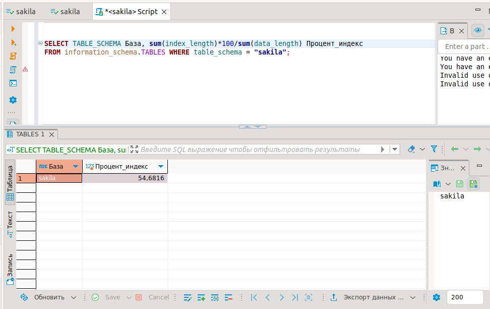
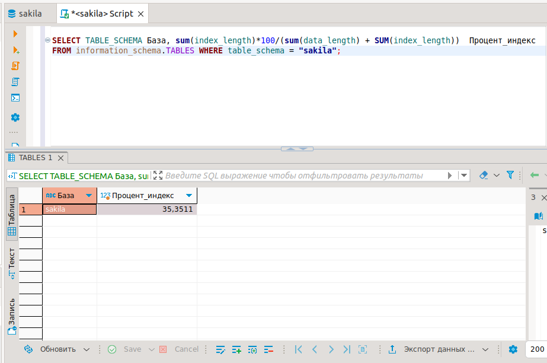
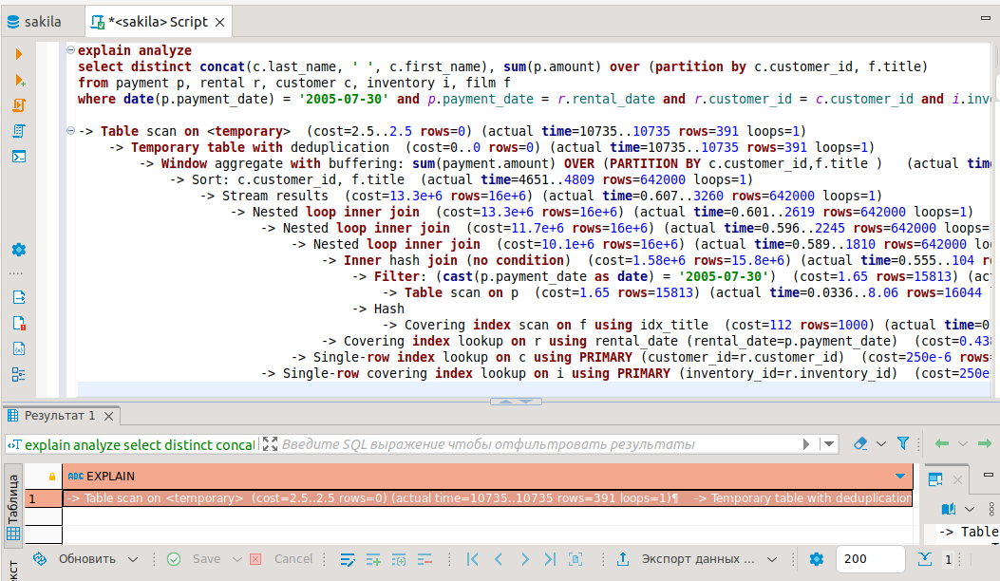
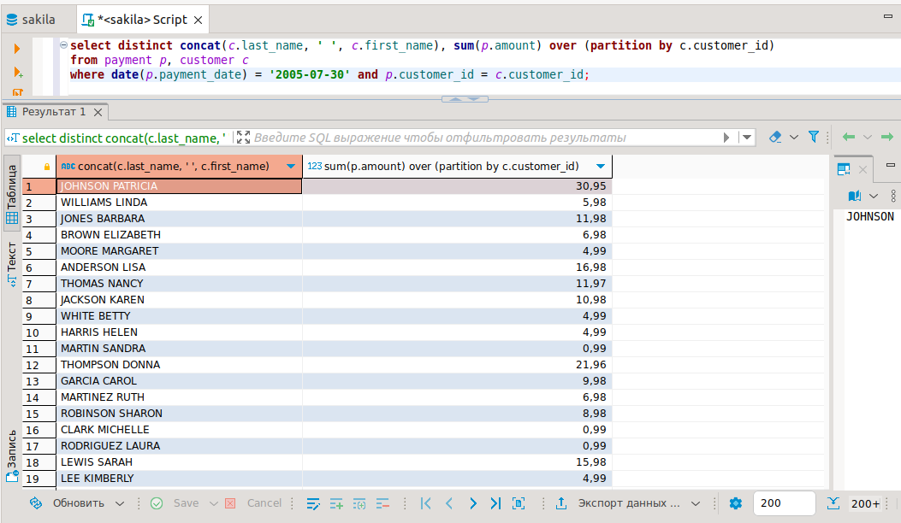
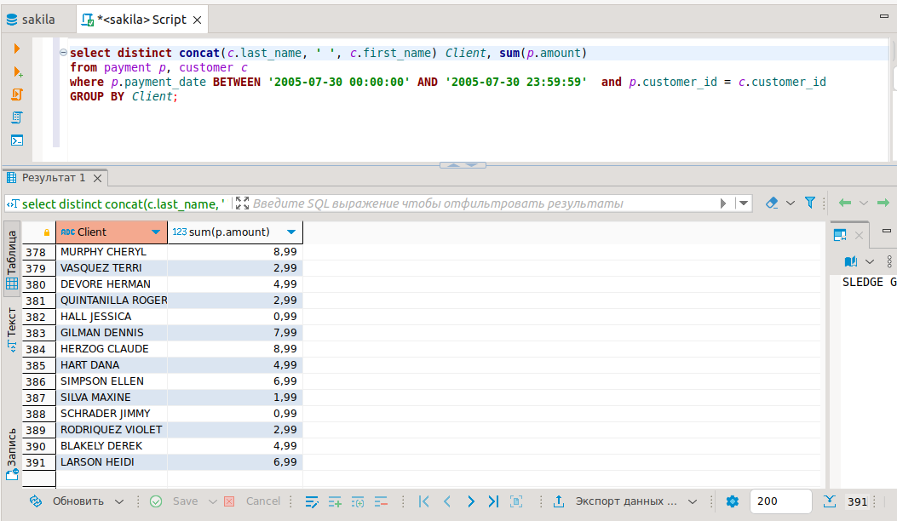

## Домашнее задание к занятию "Индексы" - Карих Елена
---
### Задание 1

Напишите запрос к учебной базе данных, который вернёт процентное отношение общего размера всех индексов к общему размеру всех таблиц.

### Решение 1

Запрос:

```
SELECT TABLE_SCHEMA База, sum(index_length)*100/sum(data_length) Процент_индекс 
FROM information_schema.TABLES WHERE table_schema = "sakila";
```



Коллеги, хотела уточнить по этому заданию...оформляя запрос получила, по моему мнению, слишком большой процент((
По заданию - ВСЕХ таблиц - это прям всех всех? То есть возможно мне таблицы с индексами тоже надо отнести ко ВСЕМ таблицам? Ведь это такие же таблицы базы...
(К сожалению, преподаватель мне уже делал замечание о не внимательном чтении задания(( не хочется его опять подводить..) 

Если изменить запрос:

```
SELECT TABLE_SCHEMA База, sum(index_length)*100/(sum(data_length) + SUM(index_length))  Процент_индекс 
FROM information_schema.TABLES WHERE table_schema = "sakila";
```



---
### Задание 2

Выполните explain analyze следующего запроса:

```
select distinct concat(c.last_name, ' ', c.first_name), sum(p.amount) over (partition by c.customer_id, f.title)
from payment p, rental r, customer c, inventory i, film f
where date(p.payment_date) = '2005-07-30' and p.payment_date = r.rental_date and r.customer_id = c.customer_id and i.inventory_id = r.inventory_id
```
- перечислите узкие места;
- оптимизируйте запрос: внесите корректировки по использованию операторов, при необходимости добавьте индексы.

### Решение 2

Запрос explain analyze:

```
-> Table scan on <temporary>  (cost=2.5..2.5 rows=0) (actual time=10735..10735 rows=391 loops=1)
    -> Temporary table with deduplication  (cost=0..0 rows=0) (actual time=10735..10735 rows=391 loops=1)
        -> Window aggregate with buffering: sum(payment.amount) OVER (PARTITION BY c.customer_id,f.title )   (actual time=4651..10373 rows=642000 loops=1)
            -> Sort: c.customer_id, f.title  (actual time=4651..4809 rows=642000 loops=1)
                -> Stream results  (cost=13.3e+6 rows=16e+6) (actual time=0.607..3260 rows=642000 loops=1)
                    -> Nested loop inner join  (cost=13.3e+6 rows=16e+6) (actual time=0.601..2619 rows=642000 loops=1)
                        -> Nested loop inner join  (cost=11.7e+6 rows=16e+6) (actual time=0.596..2245 rows=642000 loops=1)
                            -> Nested loop inner join  (cost=10.1e+6 rows=16e+6) (actual time=0.589..1810 rows=642000 loops=1)
                                -> Inner hash join (no condition)  (cost=1.58e+6 rows=15.8e+6) (actual time=0.555..104 rows=634000 loops=1)
                                    -> Filter: (cast(p.payment_date as date) = '2005-07-30')  (cost=1.65 rows=15813) (actual time=0.0514..13.6 rows=634 loops=1)
                                        -> Table scan on p  (cost=1.65 rows=15813) (actual time=0.0336..8.06 rows=16044 loops=1)
                                    -> Hash
                                        -> Covering index scan on f using idx_title  (cost=112 rows=1000) (actual time=0.0541..0.378 rows=1000 loops=1)
                                -> Covering index lookup on r using rental_date (rental_date=p.payment_date)  (cost=0.438 rows=1.01) (actual time=0.00172..0.00242 rows=1.01 loops=634000)
                            -> Single-row index lookup on c using PRIMARY (customer_id=r.customer_id)  (cost=250e-6 rows=1) (actual time=364e-6..399e-6 rows=1 loops=642000)
                        -> Single-row covering index lookup on i using PRIMARY (inventory_id=r.inventory_id)  (cost=250e-6 rows=1) (actual time=273e-6..308e-6 rows=1 loops=642000)

```



Выполнение запроса отрабатывалось (на моих ресурсах) 11 секунд и просматривалось 642000 строк.. долго((
В скрипте много "лишних" таблиц: rental, inventary, film

Убрала незадействованные таблицы, время обработки сократилось до 15мс и прочитано 634 строки:

```
explain analyze
select distinct concat(c.last_name, ' ', c.first_name), sum(p.amount) over (partition by c.customer_id)
from payment p, customer c
where date(p.payment_date) = '2005-07-30' and p.customer_id = c.customer_id;

-> Table scan on <temporary>  (cost=2.5..2.5 rows=0) (actual time=15.3..15.3 rows=391 loops=1)
    -> Temporary table with deduplication  (cost=0..0 rows=0) (actual time=15.3..15.3 rows=391 loops=1)
        -> Window aggregate with buffering: sum(payment.amount) OVER (PARTITION BY c.customer_id )   (actual time=13.1..15 rows=634 loops=1)
            -> Sort: c.customer_id  (actual time=13.1..13.2 rows=634 loops=1)
                -> Stream results  (cost=7140 rows=15813) (actual time=0.113..12.8 rows=634 loops=1)
                    -> Nested loop inner join  (cost=7140 rows=15813) (actual time=0.108..12.3 rows=634 loops=1)
                        -> Filter: (cast(p.payment_date as date) = '2005-07-30')  (cost=1606 rows=15813) (actual time=0.0836..11.3 rows=634 loops=1)
                            -> Table scan on p  (cost=1606 rows=15813) (actual time=0.0665..7.45 rows=16044 loops=1)
                        -> Single-row index lookup on c using PRIMARY (customer_id=p.customer_id)  (cost=0.25 rows=1) (actual time=0.00126..0.00132 rows=1 loops=634)
```



Создала Индекс

```
CREATE INDEX pay_date ON payment (payment_date);
```

Не оправдало себя(( время обработки увеличилось до 17мс

```
-> Table scan on <temporary>  (cost=2.5..2.5 rows=0) (actual time=17.8..17.9 rows=391 loops=1)
    -> Temporary table with deduplication  (cost=0..0 rows=0) (actual time=17.8..17.8 rows=391 loops=1)
        -> Window aggregate with buffering: sum(payment.amount) OVER (PARTITION BY c.customer_id )   (actual time=13.4..17.6 rows=634 loops=1)
            -> Sort: c.customer_id  (actual time=13.4..13.5 rows=634 loops=1)
                -> Stream results  (cost=7140 rows=15813) (actual time=0.1..13.1 rows=634 loops=1)
                    -> Nested loop inner join  (cost=7140 rows=15813) (actual time=0.096..12.6 rows=634 loops=1)
                        -> Filter: (cast(p.payment_date as date) = '2005-07-30')  (cost=1606 rows=15813) (actual time=0.0857..11.5 rows=634 loops=1)
                            -> Table scan on p  (cost=1606 rows=15813) (actual time=0.0673..7.64 rows=16044 loops=1)
                        -> Single-row index lookup on c using PRIMARY (customer_id=p.customer_id)  (cost=0.25 rows=1) (actual time=0.00153..0.00156 rows=1 loops=634)
```

Решила еще поменять запрос: убрала over, поставила group by:

```
explain analyze
select distinct concat(c.last_name, ' ', c.first_name) Client, sum(p.amount)
from payment p, customer c
where p.payment_date BETWEEN '2005-07-30 00:00:00' AND '2005-07-30 23:59:59'  and p.customer_id = c.customer_id
GROUP BY Client;

-> Table scan on <temporary>  (actual time=4.26..4.33 rows=391 loops=1)
    -> Aggregate using temporary table  (actual time=4.25..4.25 rows=391 loops=1)
        -> Nested loop inner join  (cost=507 rows=634) (actual time=0.0489..3.24 rows=634 loops=1)
            -> Index range scan on p using pay_date over ('2005-07-30 00:00:00' <= payment_date <= '2005-07-30 23:59:59'), with index condition: (p.payment_date between '2005-07-30 00:00:00' and '2005-07-30 23:59:59')  (cost=286 rows=634) (actual time=0.0406..1.96 rows=634 loops=1)
            -> Single-row index lookup on c using PRIMARY (customer_id=p.customer_id)  (cost=0.25 rows=1) (actual time=0.00171..0.00175 rows=1 loops=634)
```

Сократила время до 4.33мс



---
### Задание 3

Самостоятельно изучите, какие типы индексов используются в PostgreSQL. Перечислите те индексы, которые используются в PostgreSQL, а в MySQL — нет.

### Решение 3

SP-GiST
BRIN
BLOOM

---
